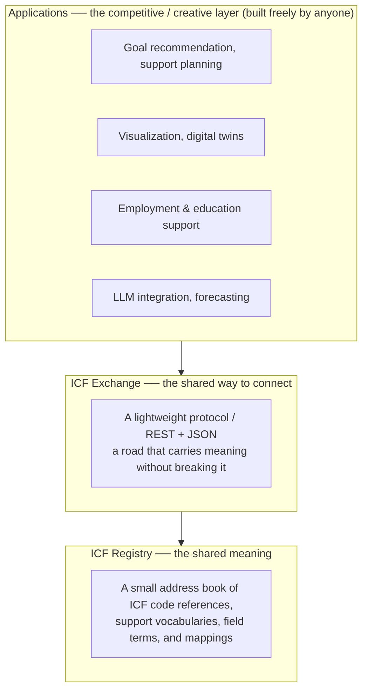

# ICF HUB

*[日本語版 / Japanese](README.md)*

**An open semantic infrastructure connecting people and social opportunities, using ICF (WHO's International Classification of Functioning, Disability and Health) as a common language**

ICF HUB is not a single product or platform. It is a public semantic infrastructure (a protocol) that anyone can connect to, consisting of three layers:

| Layer | Repository | Role |
|---|---|---|
| Registry (shared meaning) | [icf-registry](../icf-registry) | A small registry of ICF code references, support codes, activity/participation/environment vocabularies, field terms, and mappings from organization-specific codes. It does nothing clever |
| Exchange (shared connection) | [icf-exchange-spec](../icf-exchange-spec) | A lightweight protocol/API spec for exchanging ICF-based information without breaking its meaning. No analytics, no recommendation |
| Applications (competition & emergence) | anyone | On top of Registry and Exchange, anyone can build services freely — no permission needed |

## Design philosophy: small and boring

HTTP and DNS are so small that they can do almost nothing by themselves. And precisely because of that, everyone can build on them. The two lower layers of ICF HUB aim for the same position.

- **No convenience features in Registry or Exchange.** The moment features are added, the layer becomes a platform company and others hesitate to join
- **An AI that never decides.** The infrastructure only carries meaning. Judgment, recommendation, and decisions belong to the applications above — and ultimately to the person and their supporters
- **Strict separation of public and private.** The public registry and personal data are structurally separated. Personal data travels through these layers only within the scope of the person's consent
- **Owned by no one.** The specifications are published under an open license (CC BY 4.0) as a defensive publication, so that no one can enclose them with exclusive rights

## Why ICF

ICF, adopted by the WHO in 2001, describes human functioning — body functions (b/s), activities and participation (d), and environmental factors (e) — with about 1,500 codes. It is not a classification of "what people cannot do"; it is a system for describing the **interaction between a person and their environment**, and it lets education, welfare, healthcare, employment, and local communities speak the **same language**.

For the full concept model, see [IHR-001](docs/IHR-001.en.md).

## IHR (ICF Hub Requests for Comments)

Specifications are managed as a public document series called IHR. As the name says, requesting comments is the whole point.

| No. | Title | Status |
|---|---|---|
| [IHR-000](docs/IHR-000.en.md) | Purpose, numbering and revision process | Draft |
| [IHR-001](docs/IHR-001.en.md) | ICF Hub concept model and design principles | Draft |

## Governance

This project is drafted and published by Mirai no Design Inc. (Fukui, Japan). On top of this infrastructure, however, Mirai no Design itself is **just one participant**, competing in the Applications layer with its own advanced algorithms. The two lower layers are maintained as a commons, with a planned transfer of editorship to a neutral body as participation grows.

Separating public good from private business, and growing sustainably together with the region — that is the structure this project aims for.

## Participate

- Questions, opinions, field reports: open an Issue in any repository (plain everyday language is welcome)
- Proposing changes: see [CONTRIBUTING](CONTRIBUTING.md) and [IHR-000](docs/IHR-000.en.md)
- Connection inquiries: https://www.mirai-no-design.co.jp

## License & citation

Documents are licensed under [CC BY 4.0](LICENSE.md). Each release receives a DOI via Zenodo. See [CITATION.cff](CITATION.cff).

> **Note:** The ICF classification itself (full code texts and definitions) is the property of the WHO. This project does not redistribute ICF classification text; it holds only code numbers, short labels, and references to the WHO source.
