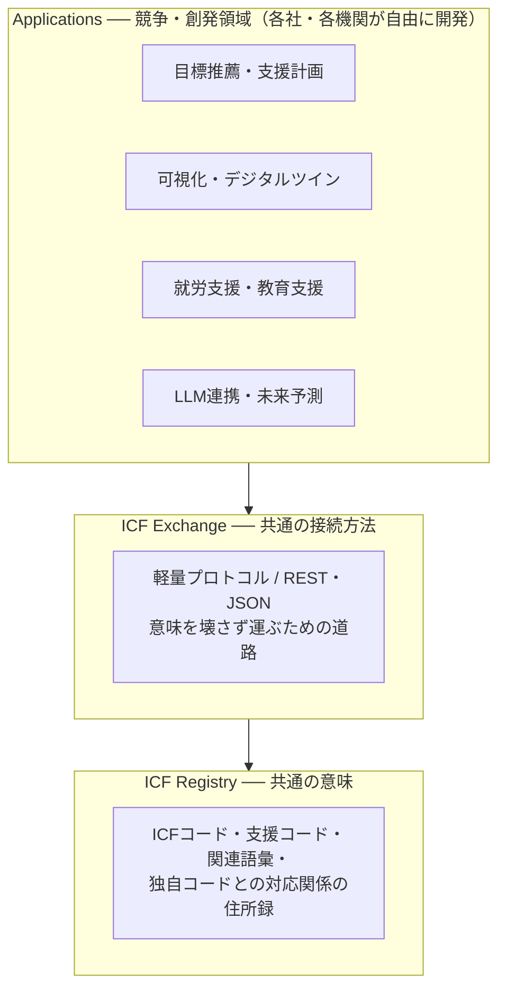

# ICF HUB

*[English](README.en.md)*

**ICF（国際生活機能分類）を共通言語に、人と社会機会をつなぐオープンな意味基盤**

ICF HUB は、単一の製品やプラットフォームではありません。誰でも接続できる公共的な意味基盤（プロトコル）であり、次の3層で構成されます。

| 層 | リポジトリ | 役割 |
|---|---|---|
| Registry（共通の意味） | [icf-registry](../icf-registry) | ICFコード・支援コード・活動/参加/環境因子・関連語彙・各組織独自コードとの対応関係を登録・参照する小さなレジストリ。「賢い処理」はしない |
| Exchange（共通の接続方法） | [icf-exchange-spec](../icf-exchange-spec) | ICFベースの情報を意味を壊さずやり取りするための軽量な共通プロトコル/API仕様。分析・推薦機能は持たない |
| Applications（競争・創発領域） | 各社・各機関 | Registry と Exchange の上に、誰でも自由にサービスを構築できる |

## 設計思想：小さく、退屈に

HTTPやDNSは、それ単体では何もできないくらい小さい。しかし、それがあるから皆が自由に作れる。ICF HUBの下2層はこの位置を目指します。

- **Registry と Exchange に便利機能を入れない。** 機能を足し始めた瞬間、そこはプラットフォーム企業になり、他社が参加しにくくなる
- **決めないAI。** 基盤は意味を運ぶだけ。判断・推薦・意思決定は、上に載るアプリケーションと人に委ねる
- **公私の完全分離。** 公開レジストリと個人データの領域を構造的に分離する。個人データはこの2層を流れる際も、本人同意の範囲でのみ運ばれる
- **誰のものでもない。** 仕様はオープンライセンス（CC BY 4.0）で公開され、防衛的公開により誰も排他的権利を取得できない

## なぜICFか

ICFはWHOが2001年に採択した国際生活機能分類です。心身機能（b/s）・活動と参加（d）・環境因子（e）を、約1,500のコードで記述できます。「できないこと」の分類ではなく、人と環境の**相互作用**を書ける体系であること、そして教育・福祉・医療・就労・地域という異なる現場を**同じことば**でつなげることが、共通言語としての採用理由です。

思想と概念モデルの全体は [IHR-001](docs/IHR-001.md) を参照してください。

## IHR（ICF Hub Requests for Comments）

仕様はIHRという公開文書シリーズで管理します。名前のとおり「コメント募集」が本質です。

| 番号 | タイトル | ステータス |
|---|---|---|
| [IHR-000](docs/IHR-000.md) | IHRの目的・発番・改訂プロセス | Draft |
| [IHR-001](docs/IHR-001.md) | ICF Hub 概念モデルと設計原則 | Draft |

Registry・Exchangeの技術仕様は各リポジトリのSPEC.mdが正本であり、大きな設計変更はIHRとして提案・議論します。

## 運営について

本プロジェクトは株式会社みらいのでざいん（福井県）が起草・公開しています。ただし、みらいのでざいん自身もこの基盤の上では**一参加者**であり、Applications層で高度なアルゴリズムを開発する立場で他社と競争します。Registry・Exchangeの2層は公共財として維持し、将来的には中立的な運営主体への移管を予定しています（[IHR-000](docs/IHR-000.md) 第6章）。

公共性と事業性を分離し、地域と共に持続的に成長する構造を目指します。

## 参加するには

- 質問・意見・現場からの報告：各リポジトリの Issues へ（現場の言葉のままで構いません）
- 仕様の提案：[CONTRIBUTING.md](CONTRIBUTING.md) と [IHR-000](docs/IHR-000.md) を参照
- 接続の相談：https://www.mirai-no-design.co.jp

## ライセンス・引用

文書は [CC BY 4.0](LICENSE.md)。リリースごとにZenodoでDOIが付与されます（[PUBLISHING.md](PUBLISHING.md)）。引用情報は [CITATION.cff](CITATION.cff) を参照してください。

> **Note:** ICF分類本体（コード全文・定義文）はWHOの著作物です。本プロジェクトはICFの分類テキストを再配布せず、コード番号・短縮ラベル・WHO正本への参照のみを扱います。
