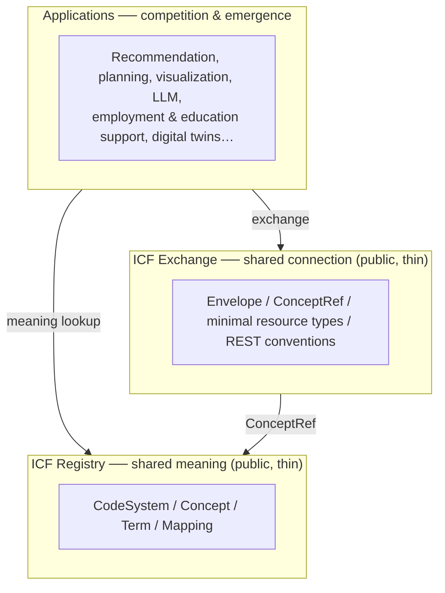

# IHR-001: ICF Hub Concept Model and Design Principles

*[日本語版 / Japanese](IHR-001.md)*

| Item | Content |
|---|---|
| IHR number | 001 |
| Title | ICF Hub Concept Model and Design Principles |
| Status | Draft |
| Created | 2026-08-10 |
| Drafted by | Mirai no Design Inc. / ICF HUB Project |
| License | CC BY 4.0 |

**Abstract:** ICF Hub is an open semantic infrastructure that connects a person's goals, states, activities and participation with diverse social opportunities (work, education, community, tourism and culture), using the WHO International Classification of Functioning, Disability and Health (ICF) as a common semantic system. It consists of two deliberately small public layers — a vocabulary registry and a lightweight exchange protocol — on top of which anyone can freely build applications. Like DNS, it is designed to be too small to do anything by itself, and for exactly that reason, to let everyone build.

---

## 1. Purpose

This IHR defines the philosophy, concept model, and design principles of ICF HUB. The technical specifications live in two repositories:

- **icf-registry** ── an address book of shared vocabulary (Registry = shared meaning)
- **icf-exchange-spec** ── a lightweight protocol that carries meaning without breaking it (Exchange = shared connection)

On top of these two layers, Applications — goal recommendation, forecasting, support planning, visualization, LLM integration, employment support, education support, digital twins, and more — can be built by anyone, without asking permission.

What ICF HUB aims to realize is not the traditional model of "person → choose one suitable occupation," but "**the life a person wishes for → the activities and participation it requires → a combination of multiple opportunities**." Work, learning, community participation, and creative practice can exist in parallel — mixed, in the way real lives actually are — and the infrastructure can represent and operate that state as-is.

## 2. Design principles

| Principle | Content |
|---|---|
| P1. Interaction model | Never a one-way intervention-effect model. ICF itself is an interaction model: person ⇄ environment ⇄ activity ⇄ participation, treated as a cycle |
| P2. An AI that never decides | The infrastructure never declares "this is what suits you." It only carries meaning; judgment and recommendation belong to applications, and ultimately to the person and their supporters |
| P3. Opportunity as the unit | The unit of registration on the society side is not a "facility" or a "job posting" but an activity-level opportunity |
| P4. Parallel portfolio | Not "work or education" but "work + education + community + creation," held simultaneously, with no fixed ratios |
| P5. Time series | State changes and environment/support events are recorded on the same timeline. No premature causal claims — first make change and intervention explainable side by side |
| P6. Strict public/private separation | Public vocabulary and public opportunity information are structurally separated from personal data. The registry holds no personal data whatsoever |
| P7. Translating field language | Use ICF not merely as database labels but as a common language that translates between different services. Always provide an entrance from everyday field words |
| P8. Personal factors kept separate | ICF defines no standard code system for personal factors, so they are handled in an independent layer (Personal Context / Preference / Goal) |
| P9. Thin infrastructure | Put no convenience features into the two public layers. The moment features are added, the layer becomes a platform and others hesitate to join. Like HTTP and DNS: "too small to do anything by itself — and that is exactly why everyone can build on it" |

## 3. Three-layer architecture

| Layer | Nature | Provider |
|---|---|---|
| Registry | Commons. Only IDs, labels, meaning references, versions, mappings, sources | ICF HUB Project (open) |
| Exchange | Commons. A road that carries meaning intact | ICF HUB Project (open) |
| Applications | Competitive layer. Advanced algorithms, products, services | Anyone — including the drafter, Mirai no Design, as one participant among many |

## 4. Concept model

### 4.1 Three layers of meaning about a person

- **Personal context layer** ── the person's wishes and goals (Goal), preferences and interests (Preference), life history and values (Personal Context). Since ICF defines no standard codes for personal factors, this is an independent layer (P8). The Goal is the starting point of every query
- **ICF interaction layer** ── body functions/structures (b/s), activities (d), participation (d), and environmental factors (e) influence one another. No element is fixed as the "cause" or "effect" of another (P1)
- **Social opportunity layer** ── opportunities for activity and participation (Opportunity), support and interventions (Intervention), and their combinations (Participation Portfolio)

### 4.2 The interaction loop

> the person's wishes and goals → current state → activities and participation → search for needed environments/support → combine opportunities → intervention and experience → environmental conditions change → activities and participation change → the person's state, experience and preferences change → goals and combinations are reconfigured (and the cycle continues)

This loop is not a one-way causal chain. Accumulated experience changes preferences and goals themselves, and changed goals change the search conditions. The infrastructure's role is to keep carrying meaning without ever stopping this cycle.

### 4.3 The DNS analogy: name resolution by meaning

As DNS answers "name → query → address," applications built on ICF HUB can answer "a person's goals, activities, participation and conditions → query → candidate social resources, support and activities."

For example, given the query "I can work alongside others if the group is small, I'm interested in plants, and I want more experiences connecting with people in my community," an application can return multiple matching opportunities **with reasons**. But that resolution (matching) is the job of the Applications layer. What the infrastructure (Registry / Exchange) guarantees is only that the asker and the answerer **speak the same semantic system**.

Crucially, no implementation at any layer ever declares "this is what suits you" (P2). Candidates come with reasons; the choice and the combination are decided by the person and their supporters.

### 4.4 Translating field language (the Semantic Layer)

Searching by ICF codes alone drifts away from the words people actually use. The registry therefore holds many-to-many, confidence-scored correspondences between field terms and concepts.

| Layer | Content | Example |
|---|---|---|
| Field terms (Term) | Words actually used in the field, incl. synonyms, dialects, organization-specific usage | "bagging" / "shelf stocking" / "customer service" |
| Semantic Layer | Term-to-concept correspondences (many-to-many, with confidence and source) | "bagging" → fine hand use (d440) |
| ICF concepts (Concept) | References to ICF codes and shared semantic concepts | d440, d740, e330 … |

The more this translation accumulates, the more different services (assessment, employment support, education, tourism…) can interpret one another's words. The dictionary grows in the registry as a commons; the technology that translates cleverly competes in the Applications layer.

## 5. Public/private separation

| Domain | Content | Where it lives |
|---|---|---|
| PUBLIC | Vocabulary (Concept / Term / Mapping), public opportunity information | icf-registry / each provider's public endpoint |
| PRIVATE | Personal assessments, goals, events, portfolios | Held by each service under its own responsibility. Exchange requires a consent reference (consent_ref) |

The registry holds no personal data. Providers never receive other parties' personal data. Personal data travels through the two layers only when it rides in an Envelope within the scope of the person's consent (P6).

## 6. Governance

This IHR is drafted by Mirai no Design Inc. As the structure above makes clear, however, the two public layers belong to no one, and Mirai no Design itself competes in the Applications layer as one participant among many. The separation of public good (lower two layers) from business (top layer) is the core of this project's sustainability. Editorship of Registry and Exchange will be transferred to a neutral body (e.g., a consortium) as participation grows.

## 7. Future IHR candidates

- Standardizing the collection and confirmation process for field-term corpora
- Interoperability of consent management (what consent_ref points to)
- Federation of registries (inter-regional / international)
- Rules for using Outcome records in impact evaluation
- Crosswalks to non-ICF systems (occupational classifications, curricula, etc.)

## 8. Prior work

This project builds on the research and development of an ICT individualized education support system, field-tested since 2009 at 16 elementary, junior-high, high and special-needs schools in Fukui, Japan. That research developed the binding of daily behavior-check items to ICF codes; a matching method between persons and support services that exposes only ICF codes and weights, never personal data (Japanese Patent No. 7247432); and API-based integration with external assistive devices. This IHR generalizes what was realized there as features inside a single system into a public registry and exchange protocol that anyone can reference.

- Y. Ogoshi and S. Ogoshi, "ICT Individualized Education Support System for Supporting Children with Developmental Disabilities," IEICE Communications Society Magazine, no. 63, pp. 197–, 2022 (in Japanese).

For readers outside Japan, an open-access English overview of the prior system (collaborative ICT platform, ICF-coded matching of needs with assistive devices and services) is available:

- S. Ogoshi, Y. Ogoshi, T. Saitoh, K. Tanaka, Y. Itoh, M. Wakamatu, T. Kanno, and A. Nakai, "Individual Education Support System Using ICT for Developmental Disabilities," in *Cognitive Behavioral Therapy — Basic Principles and Application Areas*, IntechOpen, 2023. doi:[10.5772/intechopen.106065](https://doi.org/10.5772/intechopen.106065) (open access)
