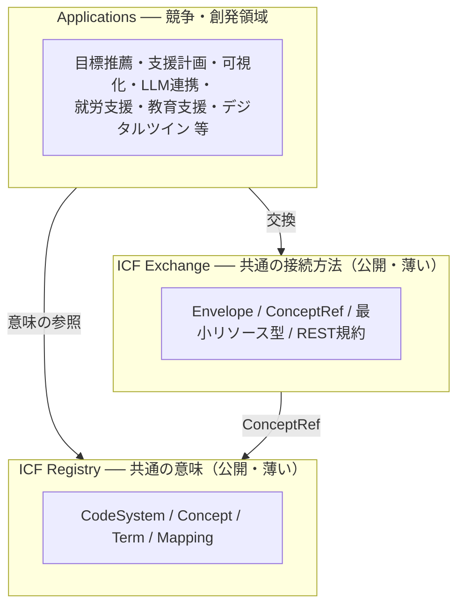

# IHR-001: ICF Hub 概念モデルと設計原則

*[English](IHR-001.en.md)*

| 項目 | 内容 |
|---|---|
| IHR番号 | 001 |
| タイトル | ICF Hub 概念モデルと設計原則 |
| ステータス | Draft |
| 作成日 | 2026-08-25 |
| 起草 | 株式会社みらいのでざいん ／ ICF HUB Project |
| ライセンス | CC BY 4.0 |

**Abstract (English):** ICF Hub is an open semantic infrastructure that connects a person's goals, states, activities and participation with diverse social opportunities (work, education, community, tourism and culture), using the WHO International Classification of Functioning, Disability and Health (ICF) as a common semantic system. It consists of two deliberately small public layers — a vocabulary registry and a lightweight exchange protocol — on top of which anyone can freely build applications. Like DNS, it is designed to be too small to do anything by itself, and for exactly that reason, to let everyone build.

---

## 1. 目的

本IHRは、ICF HUBの思想・概念モデル・設計原則を定義する。個別の技術仕様は次の2つのリポジトリが正本である。

- **icf-registry** ── 共通語彙の住所録（Registry＝共通の意味）
- **icf-exchange-spec** ── 意味を壊さず運ぶ軽量プロトコル（Exchange＝共通の接続方法）

この2層の上に、目標推薦・未来予測・支援計画・可視化・LLM連携・就労支援・教育支援・デジタルツインなどのApplications（競争・創発領域）が、誰の許可も要らずに構築できる。

ICF HUBが実現したいのは、従来の「人 → 適した職業を一つ選ぶ」というモデルではなく、「**本人の望む生活・未来 → 必要な活動・参加 → 複数の機会を組み合わせる**」というモデルである。就労・教育・地域参加・創作がパラレルに（二刀流・三刀流で）混ざった状態を、そのまま表現・運用できる社会基盤を目指す。

## 2. 設計原則

| 原則 | 内容 |
|---|---|
| P1. 相互作用モデル | 一方向の介入効果モデルにしない。ICF自体が相互作用モデルであり、人⇄環境⇄活動⇄参加を循環として扱う |
| P2. 決めないAI | 「あなたにはこれが向いています」と決定する基盤にしない。基盤は意味を運ぶだけであり、判断・推薦は上に載るアプリケーションと、最終的には本人・支援者に委ねる |
| P3. 機会（Opportunity）単位 | 社会側の登録単位は「施設」や「求人」ではなく活動単位の機会とする |
| P4. パラレル・ポートフォリオ | 「就労か教育か」ではなく「就労＋教育＋地域参加＋創作」が同時に存在できる。比率も固定しない |
| P5. 時系列で扱う | 状態変化と環境・支援の出来事を同一時間軸に記録できる形式を用意する。即座に因果を断定せず、まず変化と介入を説明可能にする |
| P6. 公私の完全分離 | 公開語彙・公開機会情報と、個人データを構造的に分離する。レジストリは個人データを一切持たない |
| P7. 現場語との翻訳 | ICFをDBの分類ラベルとして使うだけでなく、異なるサービス間を翻訳する共通言語として使う。現場語からの入口を必ず用意する |
| P8. 個人因子の分離 | ICFの個人因子は標準コード体系が未定義のため、独自層（Personal Context / Preference / Goal）として分離して扱う |
| P9. 薄いインフラ | 公開する2層（Registry / Exchange）に便利機能を入れない。機能を足し始めた瞬間、そこはプラットフォームになり、他者が参加しにくくなる。HTTPやDNSのように「これだけでは何もできないくらい小さいが、これがあるから皆が自由に作れる」位置を保つ |

## 3. 3層アーキテクチャ

| 層 | 性格 | 提供者 |
|---|---|---|
| Registry | 公共財。ID・名称・意味・バージョン・対応関係・出典のみ | ICF HUB Project（オープン） |
| Exchange | 公共財。意味を壊さず運ぶ道路 | ICF HUB Project（オープン） |
| Applications | 競争・創発領域。高度なアルゴリズム・製品・サービス | 各社・各機関（起草者であるみらいのでざいんも、ここでは一参加者） |

## 4. 概念モデル

### 4.1 3層の意味構造

人に関する意味は、次の3層で捉える。

- **個人コンテキスト層** ── 本人の希望・目標（Goal）、選好・興味（Preference）、生活史・価値観（Personal Context）。ICFの個人因子には標準コード体系がないため、独自層として分離する（P8）。Goalはすべての問い合わせの起点である
- **ICF相互作用層** ── 心身機能・身体構造（b/s）、活動（d）、参加（d）、環境因子（e）が相互に影響し合う。どの要素も他の要素の「原因」や「結果」として固定されない（P1）
- **社会機会層** ── 社会側に存在する活動・参加の機会（Opportunity）、支援・介入（Intervention）、それらの組合せ（Participation Portfolio）

### 4.2 相互作用ループ

> 本人の希望・目標 → 現在の状態 → 活動・参加 → 必要な環境／支援を探索 → 機会を組み合わせる → 介入・経験 → 環境条件が変わる → 活動・参加が変わる → 本人の状態・経験・選好も変わる → 目標や組合せを再構成（循環）

このループは一方向の因果連鎖ではない。経験の蓄積が選好や目標そのものを変え、目標の変化が探索条件を変える。基盤の役割は、この循環を止めずに「意味を運び続ける」ことである。

### 4.3 DNSアナロジー：意味による名前解決

DNSが「名前 → 問い合わせ → アドレス」を返すように、ICF HUBの上に築かれるアプリケーションは「本人の目標・活動・参加・条件 → 問い合わせ → 該当する社会資源・支援・活動の候補」を返せるようになる。

例えば「少人数なら共同作業ができ、植物への関心があり、地域で人と関わる経験を増やしたい」という問い合わせに対して、条件に合う複数の活動機会を**理由つきで**返す──ただし、この名前解決（マッチング）自体はApplications層の仕事である。基盤（Registry / Exchange）が保証するのは、問い合わせる側と答える側が**同じ意味体系で話せること**だけである。

重要なのは、どの層のどの実装も「あなたにはこれが向いています」と決定しないことである（P2）。候補には理由を添え、選択と組合せの決定は本人と支援者が行う。

### 4.4 現場語とICF概念の翻訳（Semantic Layer）

ICFコードだけで検索すると、現場の言葉と離れてしまう。そこでレジストリは、現場語（Term）とICF概念（Concept）の対応を多対多・信頼度つきで保持する。

| 層 | 内容 | 例 |
|---|---|---|
| 現場語（Term） | 現場で実際に使われる言葉。同義語・方言・組織固有の呼び方を含む | 袋詰め／品出し／接客 |
| Semantic Layer | 現場語と概念の対応（多対多・信頼度・出典つき） | 「袋詰め」→ 細かな手の使用（d440） |
| ICF概念（Concept） | ICFコードおよび共通意味概念への参照 | d440・d740・e330 … |

この翻訳が蓄積されるほど、異なるサービス間（アセスメント・就労支援・教育・観光…）が互いの言葉を解釈できるようになる。翻訳の辞書は公共財としてレジストリに育ち、翻訳を賢く行う技術はApplications層で競争される。

## 5. 公私の分離

| 領域 | 内容 | 置き場所 |
|---|---|---|
| PUBLIC | 語彙（Concept / Term / Mapping）、公開の活動機会情報 | icf-registry ／ 各提供者の公開エンドポイント |
| PRIVATE | 個人の評価・目標・出来事・ポートフォリオ | 各サービスが自らの責任で保持。交換時はExchangeの同意参照（consent_ref）が必須 |

レジストリは個人データを一切持たない。提供者側のシステムに他者の個人データを渡さない。個人データが2層を流れるのは、本人同意の範囲で封筒（Envelope）に載るときだけである（P6）。

## 6. 運営

本IHRの起草者は株式会社みらいのでざいんである。ただし前章までの構造が示すとおり、公開2層は誰のものでもなく、みらいのでざいん自身もApplications層では一参加者として競争する。公共性（下2層）と事業性（最上層）の分離が、この構想の持続可能性の核である。Registry・Exchangeの編集権は、参加者が増えた段階で中立的な運営主体（協議会等）に移管することを予定する。

## 7. 将来のIHR候補

- 現場語コーパスの収集・確認プロセスの標準化
- 同意管理（consent_ref の指す先）の相互運用
- レジストリのフェデレーション（地域間・国際間の連携）
- 変化・成果（Outcome）記録のインパクト評価への利用規約
- 職業分類・教育課程等、ICF以外の体系とのクロスウォーク

## 8. 先行研究

本構想は、2009年から福井県内の小学校・中学校・高校・特別支援学校16校で実証を重ねてきたICT個別教育支援システムの研究開発を先行研究とする。同研究では、行動チェック項目へのICFコードの紐づけ、ICFコードと重み係数のみを用いた（個人情報を外部に出さない）人と支援サービスのマッチング方式（特許第7247432号）、およびAPIによる外部支援機器連携が開発された。本IHRは、そこで単一システム内の機能として実現されていた連携を、誰でも参照できる公共のレジストリと交換プロトコルに一般化するものである。

- 小越康宏, 小越咲子: 発達障害児者支援のためのICT個別教育支援システム, 電子情報通信学会 通信ソサイエティマガジン, No.63（冬号）, pp.197–, 2022.
- S. Ogoshi, Y. Ogoshi, et al.: Individual Education Support System Using ICT for Developmental Disabilities, in *Cognitive Behavioral Therapy - Basic Principles and Application Areas*, IntechOpen, 2023. doi:10.5772/intechopen.106065（英語・オープンアクセス）
