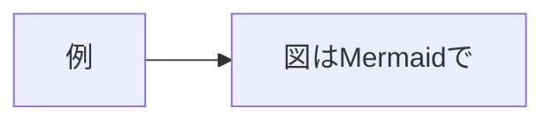

# IHR-NNN: （タイトル）

| 項目 | 内容 |
|---|---|
| IHR番号 | NNN（編集者が採番するため、提案時は「NNN」のままにしてください） |
| タイトル | （タイトル） |
| ステータス | Draft |
| 作成日 | YYYY-MM-DD |
| 著者 | （氏名または所属。連絡先は任意） |
| ライセンス | CC BY 4.0 |
| 関連IHR | （あれば。例：IHR-001を補足／IHR-00Xを置き換え） |

**Abstract (English):** （国際発信が必要な場合、3〜5文の英語要旨。不要なら削除可）

---

## 1. 背景と目的

（このIHRが解決したい問題は何か。なぜ既存のIHRでは足りないのか）

## 2. 提案内容

（仕様の本体。図はMermaidをコードブロックで埋め込む）

## 3. 設計原則との関係

（IHR-001 1.4節の原則P1〜P9のどれに関わるか。原則と矛盾する場合はその理由）

## 4. 互換性への影響

（既存のAPI・データモデル・接続実装への影響。後方互換性の有無）

## 5. セキュリティ・プライバシーへの考慮

（個人データの扱いに変更があるか。公私分離（P6）への影響）

## 6. 未解決の課題

（このIHRで決めないこと。将来のIHRに委ねること）

## 参考文献

（あれば）
